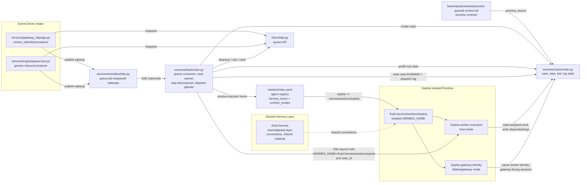
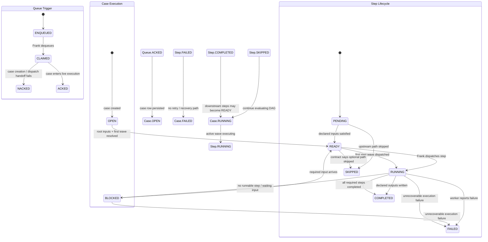

# Case Dispatch Review

This review covers the end-to-end hub dispatch path:

- `services/gateway_http/app.py` review producer
- `services/ingest/appservice.py` Matrix ingest producer
- `inbox/http.py` queue API
- `services/eventbus/http.py` wakeup bus
- `services/frank/main.py` dispatcher
- `services/cases/main.py` contract-backed case store
- `base/ops/processes/process-queued-review.md` as the concrete fast-path process

The `review_submitted` flow is used as the concrete example, but the findings below distinguish where behavior is generic versus fast-path-specific.

Update as of April 28, 2026: step worker targeting is now being separated from step action guidance. `Executor:` is the worker/profile dispatch target; `Skill:` remains action/instruction metadata for the step.

## Findings

### [P0] `review_submitted` fast path is not actually reachable through the queue contract

The `gateway_http` review producer claims it "stamps `process_path` so Frank's harness takes the fast path" and sends `process_path` in the enqueue payload, but the queue HTTP API does not accept or persist that field. `EnqueueBody` only keeps `event_type`, `source_type`, `sender`, `message_body`, `payload`, `priority`, retry settings, and `metadata`, and `Message` has no `process_path` field. Frank's fast-path entrypoint, however, only activates when `msg.get("process_path")` is present.

This means the advertised `review_submitted` shortcut does not survive the producer → queue boundary. In practice, review submissions fall back to Frank's full SOUL loop instead of the deterministic `open_case()` path. That is more severe than a normal drift issue because the nominal architecture shown in comments is not the runtime architecture being executed.

References:

- [services/gateway_http/app.py](/Users/bananawalnut/repos/hub/services/gateway_http/app.py:295)
- [services/gateway_http/app.py](/Users/bananawalnut/repos/hub/services/gateway_http/app.py:304)
- [inbox/http.py](/Users/bananawalnut/repos/hub/inbox/http.py:72)
- [inbox/http.py](/Users/bananawalnut/repos/hub/inbox/http.py:75)
- [inbox/models.py](/Users/bananawalnut/repos/hub/inbox/models.py:15)
- [services/frank/main.py](/Users/bananawalnut/repos/hub/services/frank/main.py:107)

### [P1] The dispatch prompt identifies steps by contract `step_id`, but the cases API updates by database row `id`

Frank builds `first_wave_steps` from `contract["steps"]` and labels each item as `step_db_id`, but it fills that field with the contract step identifier such as `step_1`, not the persisted `case_steps.id` row id. The cases API route that mutates step status explicitly looks up `case_steps` by database row `id`. The skill doc repeats the same `PUT /cases/{case_id}/steps/{step_id}` shape.

As written, the LLM is instructed to call the right endpoint with the wrong identifier namespace. Any implementation that follows the prompt literally will fail to mark steps `RUNNING`, which undermines the core state transition that downstream observers depend on.

References:

- [services/frank/main.py](/Users/bananawalnut/repos/hub/services/frank/main.py:176)
- [services/frank/main.py](/Users/bananawalnut/repos/hub/services/frank/main.py:199)
- [services/cases/main.py](/Users/bananawalnut/repos/hub/services/cases/main.py:219)
- [services/cases/main.py](/Users/bananawalnut/repos/hub/services/cases/main.py:340)
- [rolodex/agents/frank/skills/dispatch-work.md](/Users/bananawalnut/repos/hub/rolodex/agents/frank/skills/dispatch-work.md:82)

### [P1] Queue settlement happens before any worker success signal or case-state confirmation

On the fast path, Frank acks the queue message immediately after the LLM returns a dispatch confirmation string. There is no verification that step status was updated, that the SSH launch succeeded, or that the worker ever claimed the case. On the non-fast path, the queue is also acked immediately after the full-loop LLM response, not after case completion.

This creates a classic lost-work window: once the queue message is acked, the system has no retry authority left if the worker handoff fails after that point. The remaining recovery path is purely operational, by noticing a stuck case in `OPEN` or partially updated step state. The skill doc describes a safer design in which ack happens after monitoring the case to completion, but the runtime does not implement that behavior.

References:

- [services/frank/main.py](/Users/bananawalnut/repos/hub/services/frank/main.py:264)
- [services/frank/main.py](/Users/bananawalnut/repos/hub/services/frank/main.py:269)
- [services/frank/main.py](/Users/bananawalnut/repos/hub/services/frank/main.py:291)
- [services/frank/main.py](/Users/bananawalnut/repos/hub/services/frank/main.py:296)
- [rolodex/agents/frank/skills/dispatch-work.md](/Users/bananawalnut/repos/hub/rolodex/agents/frank/skills/dispatch-work.md:125)
- [rolodex/agents/frank/skills/dispatch-work.md](/Users/bananawalnut/repos/hub/rolodex/agents/frank/skills/dispatch-work.md:140)

### [P1] Deterministic dispatch transport is delegated to an LLM in the critical path

The harness already has all required dispatch inputs in memory: `case_id`, `cases_url`, root slots, and the intended SSH command template. Even so, the fast path still invokes `AIAgent` to perform deterministic transport operations: update step status, emit a dispatch log, and launch SSH.

That adds an avoidable failure boundary between queue claim and worker execution. Any prompt drift, tool-use failure, model outage, or partial completion inside the agent loop blocks dispatch even though no semantic reasoning is required at that point. The architecture is mixing two concerns that should be separated: process selection and transport execution.

References:

- [services/frank/main.py](/Users/bananawalnut/repos/hub/services/frank/main.py:171)
- [services/frank/main.py](/Users/bananawalnut/repos/hub/services/frank/main.py:223)
- [services/frank/main.py](/Users/bananawalnut/repos/hub/services/frank/main.py:289)

### [P2] `dispatch-work.md` no longer matches the runtime behavior

The skill document describes a much richer dispatcher than the Python service actually runs:

- probe `POST /cases/{case_id}/execute`
- inspect `/cases/openapi.json`
- capture worker stdout and pass it to `record-worker-result`
- monitor the case to completion over polling or SSE
- only ack after final review

None of those behaviors exist in `services/frank/main.py`. The live service only constructs a prompt, runs an agent loop, and then settles the queue. This matters because operators will use the skill doc as the source of truth for incidents, but it currently documents a control flow that does not exist.

References:

- [rolodex/agents/frank/skills/dispatch-work.md](/Users/bananawalnut/repos/hub/rolodex/agents/frank/skills/dispatch-work.md:74)
- [rolodex/agents/frank/skills/dispatch-work.md](/Users/bananawalnut/repos/hub/rolodex/agents/frank/skills/dispatch-work.md:114)
- [rolodex/agents/frank/skills/dispatch-work.md](/Users/bananawalnut/repos/hub/rolodex/agents/frank/skills/dispatch-work.md:125)
- [services/frank/main.py](/Users/bananawalnut/repos/hub/services/frank/main.py:240)

### [P2] Case lifecycle is under-specified at runtime and relies heavily on step state for observability

Cases are created as `OPEN`. The service exposes a case-level status update route and tracks `completed_at`, but Frank does not move cases through an explicit claimed/running lifecycle during dispatch. On the fast path, the only intended early mutation is per-step `RUNNING`. On the non-fast path, even that depends on the LLM using the cases API correctly.

The result is that external observers can see a case remain `OPEN` while work has been dispatched or partially executed. That weakens dashboards, alerting, and stuck-work detection because the durable case row does not tell the truth about dispatch progress unless consumers reconstruct it indirectly from steps and logs.

References:

- [services/cases/main.py](/Users/bananawalnut/repos/hub/services/cases/main.py:77)
- [services/cases/main.py](/Users/bananawalnut/repos/hub/services/cases/main.py:288)
- [services/cases/main.py](/Users/bananawalnut/repos/hub/services/cases/main.py:386)
- [services/frank/main.py](/Users/bananawalnut/repos/hub/services/frank/main.py:286)

### [P2] Slot serialization is inconsistent across layers and can produce double-encoded values

Frank pre-serializes lists and dicts with `json.dumps()` before POSTing them as slot values. The cases service then serializes `value` again in `_upsert_slot_value()`. Scalar values are stringified by Frank before POST as well. That produces slot storage whose shape depends on which layer wrote the value:

- direct worker writes can persist structured JSON
- Frank prefill writes can persist JSON-as-string
- numbers can become strings before reaching the case store

This inconsistency is manageable while only simple root inputs are being hydrated, but it will become a latent contract bug as more structured root slots appear or if downstream code starts assuming stable slot typing.

References:

- [services/frank/main.py](/Users/bananawalnut/repos/hub/services/frank/main.py:153)
- [services/cases/main.py](/Users/bananawalnut/repos/hub/services/cases/main.py:218)
- [services/cases/main.py](/Users/bananawalnut/repos/hub/services/cases/main.py:360)

### [P3] Producers expect the queue enqueue response field `id`, but the queue returns `message_id`

Both `gateway_http` and `ingest` read `resp.json().get("id")` after enqueue, but the queue API returns `{"message_id": ...}`. The subsequent eventbus wakeup is still published, so Frank still wakes up, but the emitted `job_id` is `None`.

This does not break dispatch because Frank ignores the wakeup payload and drains the queue opportunistically. It does, however, make event payloads inaccurate and removes a useful correlation handle for tracing producer → wakeup → claim.

References:

- [services/gateway_http/app.py](/Users/bananawalnut/repos/hub/services/gateway_http/app.py:309)
- [services/ingest/appservice.py](/Users/bananawalnut/repos/hub/services/ingest/appservice.py:198)
- [inbox/http.py](/Users/bananawalnut/repos/hub/inbox/http.py:40)
- [services/eventbus/http.py](/Users/bananawalnut/repos/hub/services/eventbus/http.py:28)

## Architecture Diagram

```mermaid
flowchart LR
    GW["services/gateway_http/app.py\nreview_submitted producer"]
    ING["services/ingest/appservice.py\nMatrix/chat producer"]
    Q["inbox/http.py\nqueue enqueue / dequeue / ack / nack"]
    EB["services/eventbus/http.py\npublish + SSE subscribe"]
    FR["services/frank/main.py\ndequeue, open_case, root-slot prefill,\nAIAgent dispatch"]
    PD["base/ops/processes/process-queued-review.md\nprocess contract source"]
    CS["services/cases/main.py\ncompile contract, persist case/steps/slots/logs,\nGET + SSE"]
    WK["Worker runtime\nSSH launch with case_id"]

    GW -->|control-plane:\nenqueue review_submitted job| Q
    GW -->|control-plane:\npublish queue.job.enqueued| EB
    ING -->|control-plane:\nenqueue generic message job| Q
    ING -->|control-plane:\npublish queue.job.enqueued| EB
    EB -->|control-plane:\nSSE subscribe queue.job.enqueued| FR
    FR -->|control-plane:\nPOST dequeue| Q
    FR -->|control-plane:\nPOST ack / nack| Q

    PD -->|contract/state-plane:\nprocess_source| CS
    FR -->|contract/state-plane:\nPOST /cases| CS
    FR -->|contract/state-plane:\nPOST /cases/{id}/slots| CS
    FR -->|contract/state-plane:\nPUT /cases/{id}/steps/{step_db_id}\nPOST /cases/{id}/logs| CS
    WK -->|contract/state-plane:\nstep updates, slot outputs, logs,\nstatus writes| CS

    FR -->|execution-plane:\nSSH launch using case_id| WK
```

## Isolated Hermes Runtime Diagram



### Diagram notes

- `/hub/.hermes` remains the shared/global Hermes layer, but it is not the live dispatch target for workers.
- Runnable workers use isolated homes such as `/hub/.hermes/workers/sophia` so sessions, auth, logs, and active state do not collide.
- Frank still owns queued SOP intake, decomposition, and dispatch intent.
- Workers execute against the cases service directly and may update steps, slots, logs, and final status.
- Sophia is one worker identity with two runtime modes: `host` for case execution and `gateway` for Matrix-facing interactions.

## End-to-End Flow Notes

### Nominal review fast path as designed

1. `gateway_http` stores review assets and record, then enqueues a `review_submitted` job and publishes `queue.job.enqueued`.
2. Frank subscribes to the eventbus, dequeues from the workspace queue, notices `process_path`, creates a contract-backed case, pre-fills root slots, then dispatches the first wave to a worker.
3. The worker executes against the cases service using `case_id`, updating steps, slots, logs, and final status.

### What the current implementation actually does

1. `gateway_http` attempts to send `process_path`, but the queue contract drops it.
2. Frank therefore receives a message without `process_path` and falls back to the full LLM loop.
3. If the fast path were ever reached by another producer or manual queue injection, the dispatch prompt would still tell the LLM to mutate steps using contract step ids instead of persisted row ids.
4. Queue ack currently happens after the LLM reports dispatch, not after worker completion or verified case progress.

### Executor vs action

The process contract should distinguish two different concerns per step:

- `Executor:` identifies the worker/profile Frank should dispatch to.
- `Skill:` identifies the step action or guide the worker should apply once it receives the step.

Those fields should not be inferred from one another. A step may have:

- an explicit executor and a skill
- an explicit executor and no skill
- a skill and no explicit executor, in which case dispatch falls back to the default worker target

For the queued review process, the live process doc now declares `Executor: sophia` explicitly on each step so Frank can target a real worker identity without conflating that with step skills such as `transcribe-review-audio`.

## Verification Scenarios

- Validate that a `review_submitted` message dequeued by Frank actually contains `process_path`; if not, the fast path is unreachable by construction.
- Inject a synthetic fast-path message with a known `process_path` and confirm that the first-wave step mutation uses the persisted `case_steps.id`, not the contract `step_id`.
- Simulate SSH launch failure after queue ack and verify that the resulting stuck case is detectable from `GET /cases/{id}` and logs alone.
- Confirm that partial or missing root-slot hydration prevents first-wave execution cleanly instead of producing silent misdispatch.
- Check whether `GET /cases/{id}` reflects real lifecycle progress at the case row level or only via step/log inspection.
- Validate that a non-fast-path message without `process_path` still completes the full SOUL flow and settles the queue in a predictable state.

## Proposed State Model

This is the simpler operational model:

- Queue settlement is only about whether the inbound trigger was durably converted into case execution.
- Case lifecycle tracks the durable SOP execution state.
- Step lifecycle tracks runnable/completed work units inside the case.
- Slots are the durable record of produced outputs, but step completion should be validated against declared outputs, not inferred from slot existence alone.

### Mermaid State Machine



### Operational Rules

- Queue `ACK` means the trigger job has been durably transformed into a live case execution attempt. It does not mean the case completed successfully.
- Queue `NACK` means Frank could not create or start the case execution attempt at all.
- A case should move to `RUNNING` before queue `ACK`, so the trigger is only settled after execution has actually started.
- Steps should move through `PENDING -> READY -> RUNNING -> COMPLETED|FAILED|SKIPPED`.
- A step should be considered `COMPLETED` when all of its declared output variables have been written for that step.

### Output Provenance Rule

To make step completion safe, each slot write should carry provenance:

- `slot_name`
- `value`
- `agent_run_id`
- `produced_at`

Then the completion rule becomes:

- a step is `COMPLETED` iff every declared output slot for that step is non-null

That avoids false completion from:

- prefilled root-input slots
- stale outputs left behind from retries
- another step writing the same slot name

Current implementation note:

- the prompt-driven case loop and step loop are intentional
- the workers use the case toolset plus instructions/skills rather than a bespoke Python loop engine
- `agent_run_id` is retained for audit/debugging provenance, not as the dependency key for completion

## Assumptions

- "Case dispatching" means turning an enqueued job into a contract-backed case plus a worker execution handoff.
- `review_submitted` is the best concrete example because it is the only path that explicitly attempts to bypass process matching with a pre-selected process doc.
- This document is a review artifact only. It does not prescribe fixes beyond identifying the correctness and observability gaps.

## Hermes Direction and Tradeoffs

The current hub architecture still reflects a pre-Hermes split: hub-owned agent directories, hub-owned dispatch semantics, and Hermes treated mainly as a worker transport. Given Hermes now has first-class sessions and profile isolation, I agree with moving more of the agent runtime boundary into Hermes and making hub thinner around orchestration and case state.

Official Hermes docs relevant here:

- [Sessions](https://hermes-agent.nousresearch.com/docs/user-guide/sessions)
- [Profiles](https://hermes-agent.nousresearch.com/docs/user-guide/profiles)

### Recommended direction

1. Keep one repo-local shared Hermes layer at `/hub/.hermes`.
2. Use isolated worker homes under `/hub/.hermes/workers/<agent>` as the runnable runtime identity for workers.
3. Keep Frank responsible for process-step decomposition and for assembling the execution packet: step wave, guides, resources, and contract expectations.
4. Let workers execute the dispatched process steps and fan out to subagents through Hermes when the step warrants it.
5. Keep the hub responsible for durable process contract state, queueing, and auditability.

That is the cleanest division of labor:

- Hermes owns worker-local identity, prompt/personality, per-agent config, sessions, memory, and subagent composition.
- Hub owns process contracts, cases, event-driven queue semantics, event routing, and cross-agent execution audit.
- Frank owns decomposition of queued SOP work into executable step waves and the assembly of the worker-facing execution context.

### Why this is a better fit

Hermes homes already scope `config.yaml`, `.env`, `SOUL.md`, sessions, logs, memory, and state by `HERMES_HOME`. Hermes sessions are also persistent across CLI and gateway sources and resumable by name or ID. That is a better primitive for worker runtime identity than copying `rolodex/agents/*` into standalone agent directories and re-implementing parts of the lifecycle in hub code.

The practical upside is:

- less custom runtime surface for the hub to maintain
- faster adoption of upstream Hermes improvements
- easier contribution path upstream when a runtime feature is missing
- more natural worker-side decomposition, because Hermes already understands session continuity and agent profiles

### Specific implications for your three points

#### 1. Isolated Hermes homes for runnable workers instead of copied agent directories

I agree. The current duplication between hub `rolodex/agents/*`, Hermes home(s), and SSH launch assumptions is unnecessary.

Best interpretation:

- `rolodex/agents/*` remains as hub metadata and trust/capability registry
- actual runnable worker state lives under isolated Hermes homes
- dispatch targets a worker `HERMES_HOME`, not a mutable profile selection inside a shared home

Tradeoffs:

- Pro: one runtime model for Frank, Sophia, and future workers
- Pro: easier upstream compatibility because you are using Hermes the way it is intended
- Pro: profile-local config/env separation is cleaner than custom per-agent folder conventions
- Con: you will need a thin mapping layer from hub agent identifier to Hermes profile
- Con: some current hub-specific agent metadata may not belong in Hermes and should stay in rolodex

#### 2. Configure Hermes from hub root with `/hub/.hermes`

This is viable and probably the right default for local development on this repo. It makes the deployment self-contained and keeps agent state colocated with the hub checkout.

Tradeoffs:

- Pro: simpler local setup and reproducibility
- Pro: explicit, repo-local control of profiles, sessions, config, and logs
- Pro: easier to version conventions around profile bootstrap scripts and default config
- Con: sessions and runtime state become coupled to this checkout path
- Con: repo-local `.hermes` is operational state, not source; it must stay out of Git
- Con: if multiple hub checkouts exist on one machine, each gets isolated agent state, which is sometimes good and sometimes wasteful

My recommendation is:

- use `/hub/.hermes` as `HERMES_HOME` for the deployment default profile
- store per-agent profiles under `/hub/.hermes/profiles/<agent>`
- keep only bootstrap/config templates in the repo, not live session databases or mutable state

#### 3. Worker executes dispatched process steps and can dispatch subagents

I agree with the worker-side subagent part, but with the boundary you clarified: Frank should still perform the step decomposition for case resolution and provide the relevant guides, resources, and contract expectations with the dispatch. The worker should not be inventing the case DAG. It should be executing the wave Frank assigned, and it may decompose that wave further internally through Hermes when useful.

That changes Frank's role from:

- intent resolution
- process matching
- task decomposition
- execution-packet assembly
- transport dispatch

to a narrower role:

- dequeue and trust gate
- choose or confirm process
- generate the case DAG / step waves
- attach the relevant guides, resources, and execution instructions
- create case and seed root slots
- assign the next executable wave to a worker profile
- monitor or react to durable case-state events

Tradeoffs:

- Pro: removes a central coordination bottleneck
- Pro: preserves a single planner for case resolution
- Pro: scales better when worker domains differ
- Con: case-state updates become more distributed, so output contracts must stay strict
- Con: worker autonomy increases the need for explicit write discipline against the cases API
- Con: debugging moves from "what did Frank decide?" to "what happened across worker lineage and subagents?"

### On the redundant environments

Your instinct is right: there is currently too much overlap between:

- hub agent definitions in `rolodex/agents/*`
- Hermes runtime homes and session state
- worker launch environment assumptions in prompts/docs
- repo-local versus host-local identity/config

The redundancy comes from trying to represent the same concepts in multiple systems:

- agent identity
- agent instructions
- agent runtime config
- agent memory/session continuity
- agent execution topology

Only agent identity, trust/capability metadata, and case-planning state really need hub-specific representation. Runtime execution state should be pushed into Hermes unless the hub needs it for audit or policy.

### Matrix access should be profile-scoped

Hermes' Matrix integration reinforces the same architecture choice. Matrix behavior is tied to Hermes runtime configuration and session handling:

- each profile has its own `config.yaml`, `.env`, `SOUL.md`, sessions, logs, and state
- Matrix configuration is driven from Hermes config/env
- Matrix sessions are isolated by DM, thread, and usually by user within shared rooms
- access can be restricted per bot/profile through allowed users and room behavior settings

That means "agent X has Matrix access" should really mean "Hermes profile X is configured with a specific Matrix identity and specific Matrix access rules," not "the hub generally has Matrix access and agents borrow it."

Practically, this is a good fit for your direction:

- Frank can have Matrix access appropriate for event-driven intake and operator interaction.
- Other profiles can have narrower Matrix access, or none at all.
- A worker profile that needs Matrix context can be given its own Matrix identity, rooms, mention behavior, and allowed-user policy.

Tradeoffs:

- Pro: least-privilege becomes much easier because Matrix identity and access live with the profile
- Pro: session continuity in Matrix maps naturally to the executing Hermes profile
- Pro: shared-room isolation defaults reduce accidental context bleed across participants
- Con: if multiple profiles need Matrix presence, you now manage multiple bot identities or multiple profile-specific policies
- Con: Matrix gateway configuration becomes part of profile operations, not just hub operations
- Con: case dispatch should pass references to the relevant Matrix context rather than assuming one global Matrix agent state

### Queue scope clarification

The queue should be treated narrowly: it is for incoming jobs that trigger SOP execution in the event-driven architecture. It is not the universal work bus for the machine.

That means there are two distinct operating modes:

- Event-driven SOP mode:
  incoming event lands in the queue, Frank resolves it into a case, decomposes the case into steps/waves, and dispatches for case execution.
- Host work mode:
  ordinary work happens directly on the host by the appropriate Hermes profile without going through the queue or becoming a cases workflow unless it truly needs SOP-style durability and audit.

This distinction matters because it prevents the hub from over-modeling normal agent activity as queued work. Cases should represent durable, event-driven process execution, not every interactive task a profile performs on the host.

### Proposed boundary after consolidation

- Hub keeps:
  - rolodex identity/trust/capability metadata
  - process docs and compiled contracts
  - Frank's decomposition/planning for queued SOP execution
  - cases, steps, slots, logs, queue, and eventbus
  - policy about which profile can execute which step class
- Hermes keeps:
  - profile runtime config
  - `SOUL.md` and per-agent behavior
  - profile-scoped Matrix identity, session model, and room/DM policy
  - sessions, memory, logs, gateway/runtime state
  - worker-local subagent orchestration

That leaves one intentional overlap:

- hub knows agent names and permissions
- Hermes knows how those named agents actually run

That overlap is acceptable because it is a contract boundary, not duplicated mutable runtime state.

### Main tradeoff summary

- Maximizing Hermes use reduces custom hub runtime code and improves upstream leverage.
- Keeping cases in the hub preserves the durable execution graph and audit surface Hermes does not replace.
- Keeping Frank as the decomposer preserves a single planner for event-driven SOP resolution while still allowing workers to parallelize locally.
- Repo-local `.hermes` improves operability for this project, but it should be treated as deployment state, not source code.
- Worker-side subagent dispatch is the right scale-out point, but only if case output contracts stay strict and machine-validated.
- Matrix should be attached to Hermes profiles as an explicit per-profile capability, not modeled as a single shared ambient hub resource.
- The queue should stay narrow in scope; if everything flows through it, you recreate an unnecessary internal workflow engine for ordinary host work.

### Suggested next architectural move

If this direction is accepted, the next design step should be to replace "dispatch by SSHing a generic Hermes home" with "dispatch to a named Hermes profile with a strict case-execution contract assembled by Frank," then remove hub-owned agent runtime duplication incrementally from there.

## Next Moves

The current architecture is now in the right shape. The next work should focus on making the prompt-driven execution path operational and observable, not on adding a second orchestration layer in code.

### 1. Auto-load the case toolset in worker sessions

- Ensure the Hermes runtime/session that launches a `case_id` always has the case tools available.
- Verify the worker can call `get_case`, `set_step_running`, `write_slot`, `add_case_log`, `set_step_failed`, and `set_step_completed` without manual setup.
- Treat this as a runtime bootstrap concern, not a prompt convention.

### 2. Make case-entry execution packets explicit

- Frank should pass an execution packet that includes:
  - `case_id`
  - runnable step row ids
  - executor guidance
  - resources/guides
  - any initial notes or memo seeds
- The parent worker should use that packet to launch step subagents via the `case-execution-loop`.

### 3. Exercise a real end-to-end local run

- Validate `review_submitted` end-to-end with Sophia’s isolated `HERMES_HOME`.
- Confirm the worker:
  - reads the case
  - sets steps `RUNNING`
  - writes outputs with `agent_run_id`
  - lets the cases service derive `COMPLETED` and downstream `READY`
- Confirm the monitor UI reflects `READY`, `RUNNING`, `BLOCKED`, `COMPLETED`, and `FAILED` correctly.

### 4. Tighten operational observability

- Log `agent_run_id` consistently in case logs for every step subagent run.
- Make it easy to correlate:
  - queue message
  - case
  - dispatched step rows
  - worker home
  - agent run ids
- This is the shortest path to debugging stuck or partial executions without building extra orchestration code.
