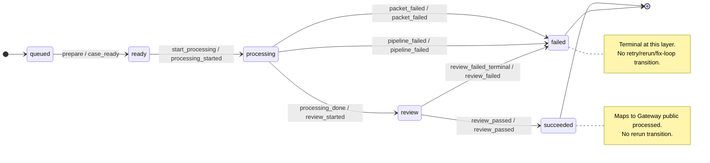

# Review Case Automaton

The Review Case Automaton is the narrow status contract Frank uses when a native review case reaches review-packet writeback.

It intentionally does not model Frank retries, reruns, or fix loops. Those operations can have side effects in Cases, Gateway, Queue, Eventbus, service runtime state, and external systems touched by process steps. They must not be represented as transitions out of `review`, `succeeded`, or `failed` in this automaton. For now, a failed review/packet is terminal at this layer; any future recovery must be designed as a separate operator workflow with its own source-of-truth and side-effect contract.

This document is the repository-owned version of the automaton diagram and supersedes the 2026-05-24 planning diagram/notes. Historical plans may describe the earlier deployment posture; this file describes the current source contract.

## Compatibility boundary

Gateway public review status remains the existing public enum:

```text
queued
processing
processed
failed
```

The automaton's internal `succeeded` state maps to public Gateway `processed`. Public `succeeded` is still rejected by the Gateway status endpoint.

## Finite automaton

```text
Q  = {queued, ready, processing, review, succeeded, failed}
Σ  = {prepare, start_processing, processing_done, packet_failed, pipeline_failed, review_passed, review_failed_terminal}
q0 = queued
F  = {succeeded, failed}
```

The implementation currently exercises the review-packet writeback slice directly from Frank Step 8:

- `review_packet_ready` is treated as `review + review_passed`.
- Any non-`review_packet_ready` packet is treated as `processing + packet_failed`.

The earlier lifecycle states remain in the automaton so producer/runner code can represent the whole case lifecycle without overloading Gateway's public status enum.

## Transition table

| Current state | Event | Next state | Reason | Gateway public status |
|---|---|---|---|---|
| `queued` | `prepare` | `ready` | `case_ready` | `processing` |
| `ready` | `start_processing` | `processing` | `processing_started` | `processing` |
| `processing` | `processing_done` | `review` | `review_started` | `processing` |
| `processing` | `packet_failed` | `failed` | `packet_failed` | `failed` |
| `processing` | `pipeline_failed` | `failed` | `pipeline_failed` | `failed` |
| `review` | `review_passed` | `succeeded` | `review_passed` | `processed` |
| `review` | `review_failed_terminal` | `failed` | `review_failed` | `failed` |

No transitions are defined out of terminal states.

## Diagram



## Metadata persisted by Gateway

Gateway may persist these additive metadata fields when Frank writes status:

```text
automaton_status
automaton_event
review_outcome
review_scope
review_packet_path
review_packet_status
status_reason
```

Gateway no longer accepts or persists automaton retry/rerun metadata such as `fix_attempt_count`, `resume_step_index`, `effective_resume_parent_index`, or `rerun_step_indexes`.

## First-slice packet rule

For this slice:

- `review_packet_ready` writes Gateway public `processed`, automaton status `succeeded`, event/reason `review_passed`, and full review scope.
- Any non-`review_packet_ready` packet writes Gateway public `failed`, automaton status `failed`, event/reason `packet_failed`, and preserves the packet status for operator/UI diagnosis.

This conservative behavior prevents a degraded packet from remaining incoherently `processing` while also being semantically failed.
